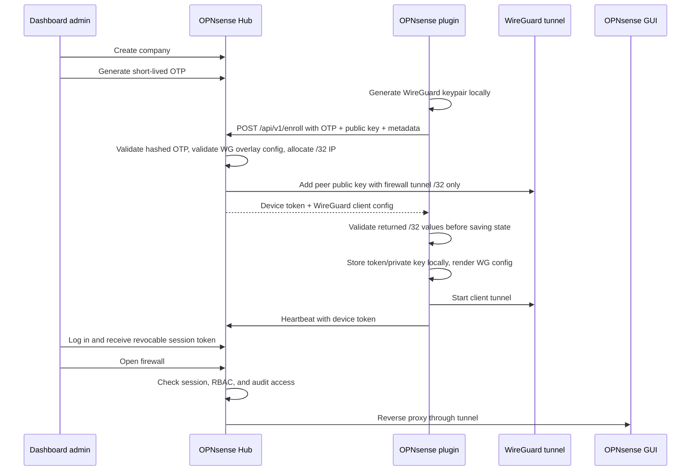

# OPNsense Hub architecture

OPNsense Hub is split into two separately deployable parts:

1. `os-opnsensehub` OPNsense plugin
2. `opnsense-hub` Dockerized dashboard/control-plane

The platform focuses on secure enrollment, remote firewall access, company grouping, audit logging, and WireGuard peer lifecycle management.

## High-level flow

## Dashboard/control-plane

- FastAPI serves both REST API and server-rendered UI.
- PostgreSQL stores users, companies, enrollment codes, devices, sessions, events, and audit logs.
- Dashboard auth uses random server-side session tokens stored hashed with expiration and revocation.
- Device token bearer auth protects post-enrollment device endpoints.
- WireGuard server setup is bootstrapped by the app container on startup.
- Startup validates `HUB_WG_CIDR` and `HUB_WG_ADDRESS`, generates/persists the Hub server key, renders `wg0.conf`, brings up `wg0`, and restores non-revoked peers from the database.
- WireGuard peers are managed by a small validated wrapper around `wg set`.
- Peer routes are `/32` only: one unique firewall tunnel IP per device. Customer LAN subnets are never routed, so overlapping company LANs do not conflict.
- By default the Hub disables IPv4/IPv6 forwarding and installs an idempotent firewall rule that drops forwarded `wg0 -> wg0` traffic to preserve peer isolation.
- Reverse proxying is implemented in FastAPI and proxies to `https://{device_tunnel_ip}:443` after RBAC checks.
- Branding uploads are stored in a persistent directory and served back through `/branding/logo`, with uploaded assets taking precedence over any configured fallback logo URL.

For local development without kernel WireGuard access, set `WG_DRY_RUN=true`. For real tunnels, the app container runs with `NET_ADMIN` and `/dev/net/tun` so it can configure `wg0` itself.

## OPNsense plugin

The plugin is scaffolded using standard OPNsense MVC/configd layout:

- PHP MVC controllers only save settings and invoke configd actions.
- Privileged operations live in Python scripts under `src/opnsense/scripts/OPNsense/OPNsenseHub`.
- The plugin generates the WireGuard private key locally; the private key is never sent to Hub.
- The plugin validates Hub-returned `interface_address` and `allowed_ips` before rendering config, reusing saved state, or starting the WireGuard client.
- Enrollment code is cleared after successful enrollment.
- Device token is stored locally with restrictive file permissions by the backend script.

Some OPNsense service paths and WireGuard startup commands are marked `verify against current OPNsense plugin conventions` because exact integration can vary by OPNsense and WireGuard plugin version.

## Security boundaries

- OTPs are hashed at rest and single-use.
- Dashboard session tokens and device tokens are generated randomly and stored hashed in the Hub database.
- Device revocation removes the WireGuard peer and marks the device revoked.
- Dashboard users are authorized at company scope through `company_users`.
- The Hub never stores OPNsense administrator passwords.
- Firewall access is reverse-proxied through WireGuard and audit logged.
- The dashboard does not create firewall policies, restore config, reboot firewalls, or reconfigure OPNsense beyond the plugin’s own local WireGuard client setup.
- The Hub is not a site-to-site router. It only reaches each firewall web UI through that firewall's unique WireGuard tunnel `/32`.
- Firewalls must never be able to reach each other or route customer LANs through the Hub overlay.
