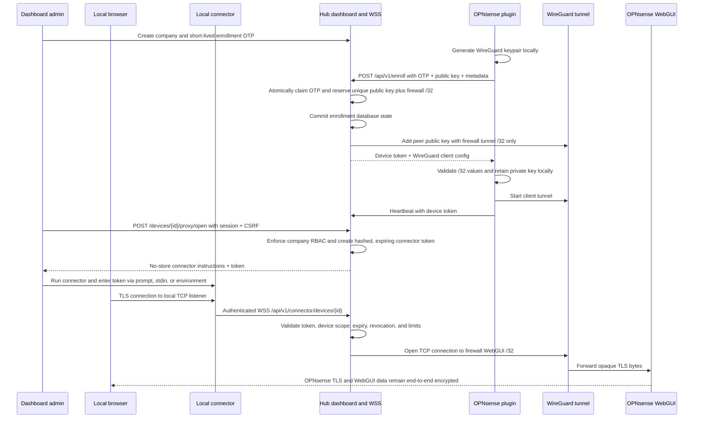

# OPNsense Hub architecture

OPNsense Hub is split into two separately deployable parts:

1. `os-opnsensehub` OPNsense plugin
2. `opnsense-hub` Dockerized dashboard/control-plane

The platform focuses on secure enrollment, remote firewall access, company grouping, audit logging, and WireGuard peer lifecycle management.

## High-level flow

```mermaid
sequenceDiagram
    participant Admin as Dashboard admin
    participant Browser as Local browser
    participant Connector as Local connector
    participant Hub as Hub dashboard and WSS
    participant Plugin as OPNsense plugin
    participant WG as WireGuard tunnel
    participant FW as OPNsense WebGUI

    Admin->>Hub: Create company and short-lived enrollment OTP
    Plugin->>Plugin: Generate WireGuard keypair locally
    Plugin->>Hub: POST /api/v1/enroll with OTP + public key + metadata
    Hub->>Hub: Atomically claim OTP and reserve unique public key plus firewall /32
    Hub->>Hub: Commit enrollment database state
    Hub->>WG: Add peer public key with firewall tunnel /32 only
    Hub-->>Plugin: Device token + WireGuard client config
    Plugin->>Plugin: Validate /32 values and retain private key locally
    Plugin->>WG: Start client tunnel
    Plugin->>Hub: Heartbeat with device token
    Admin->>Hub: POST /devices/{id}/proxy/open with session + CSRF
    Hub->>Hub: Enforce company RBAC and create hashed, expiring connector token
    Hub-->>Admin: No-store connector instructions + token
    Admin->>Connector: Run connector and enter token via prompt, stdin, or environment
    Browser->>Connector: TLS connection to local TCP listener
    Connector->>Hub: Authenticated WSS /api/v1/connector/devices/{id}
    Hub->>Hub: Validate token, device scope, expiry, revocation, and limits
    Hub->>WG: Open TCP connection to firewall WebGUI /32
    WG->>FW: Forward opaque TLS bytes
    FW-->>Browser: OPNsense TLS and WebGUI data remain end-to-end encrypted
```

## Dashboard/control-plane

- FastAPI serves both REST API and server-rendered UI.
- PostgreSQL stores users, companies, enrollment codes, devices, sessions, events, and audit logs.
- Dashboard auth uses random server-side session tokens stored hashed with expiration and revocation.
- Device token bearer auth protects post-enrollment device endpoints.
- The internet-facing FastAPI web process runs without Linux capabilities and delegates privileged WireGuard operations to the narrow `opnsense-hub-wireguard` sidecar over an authenticated internal agent API.
- Startup validates `HUB_WG_CIDR` and `HUB_WG_ADDRESS`; the sidecar generates/persists the Hub server key, renders `wg0.conf`, brings up `wg0`, installs/verifies tunnel isolation, and restores non-revoked peers received from the web process after database migration/bootstrap.
- WireGuard peers are managed by a small validated wrapper around the agent API and sidecar-local `wg set` calls.
- Enrollment atomically claims one unexpired OTP, reserves the device row before touching WireGuard runtime state, and enforces unique WireGuard public keys and tunnel `/32` addresses. Customer LAN subnets are never routed, so overlapping company LANs do not conflict.
- By default the Hub disables IPv4/IPv6 forwarding and installs a verified tunnel policy. All forwarding originating from `wg0` is dropped regardless of output interface. Input from `wg0` permits established/related return traffic plus new IPv4 TCP connections from `HUB_WG_CIDR` to the exact `HUB_WG_ADDRESS` and `HUB_CONTROL_PLANE_PORT`; every other IPv4/IPv6 tunnel-input packet is dropped.
- `PUBLIC_URL` is the dashboard/control-plane origin. It serves normal HTTPS routes and the authenticated WSS connector upgrade at `/api/v1/connector/devices/{device_id}`.
- Opening a firewall starts with a CSRF-protected `POST /devices/{device_id}/proxy/open`. After dashboard session and company-scoped RBAC checks, the Hub creates a random, short-lived, device-scoped connector token bound to the issuing dashboard session, stores only its hash, writes a `device.connector.open` audit event, and returns `no-store` instructions.
- Each connector WSS connection authenticates with that token in an `Authorization: Bearer` header. The Hub checks token expiry, device scope, issuing dashboard-session state, user/company access, and device revocation before connecting to `OPNSENSE_GUI_PORT` on the device's validated WireGuard `/32`, immediately before accepting the WSS stream, and periodically while it remains active.
- The Hub accepts binary WSS frames only and copies bytes between WSS and the firewall TCP socket. It does not terminate the browser-to-firewall TLS session, parse HTTP, inject cookies, or receive OPNsense credentials.
- `/proxy/bootstrap` and `/proxy/devices/*` are not routed. `PROXY_PUBLIC_URL` now supplies only the optional raw relay's base DNS hostname; it is not an L7 browser proxy origin.
- The bundled Caddy configuration handles dashboard HTTP(S), including the connector WSS upgrade. Raw public relay ports bypass Caddy.
- Background scheduler loops for health checks, firmware-check marking, and log retention run under PostgreSQL advisory locks so only one application process performs each scheduled job at a time. Non-leader processes poll for the lock and take over if the holder exits.
- The Hub only stores and displays reported firmware status; it does not probe or install firewall updates itself.
- Branding uploads are stored in a persistent directory and served back through `/branding/logo`, with uploaded assets taking precedence over any configured fallback logo URL.

For local development without kernel WireGuard access, set `WG_DRY_RUN=true`. For real tunnels in the Compose deployment, only the WireGuard sidecar runs as root with `NET_ADMIN`, `/dev/net/tun`, UDP `51820`, and the `/etc/wireguard` volume; the public web process remains an unprivileged UID with all capabilities dropped.

## Local connector

`connector/opnsense_hub_connector.py` is a user-side Python process, not a firewall agent. Its default listener is `127.0.0.1:8443`. For every accepted local TCP connection it opens a separate authenticated WSS stream to the selected device endpoint, then forwards opaque binary bytes in both directions.

The connector token is accepted only through a hidden interactive prompt, one line on standard input, or `OPNSENSE_HUB_CONNECTOR_TOKEN`; it is deliberately not accepted as a CLI argument or URL value. Loopback binding prevents other hosts from using the local entry point by default. Binding to a non-loopback address exposes an unauthenticated local TCP path and requires explicit host-level controls.

The browser connects with HTTPS to the local listener, but OPNsense terminates TLS. Therefore the target WebGUI certificate controls trust, hostname validation, redirects, and client-certificate behavior. If the certificate expects a firewall hostname, map that hostname to loopback on the connector host and pass the same name with `--browser-host`; this changes the displayed URL, not DNS or the listener bind address.

Immediate connector socket cleanup and connection accounting are process-local. The shipped deployment uses one Uvicorn process. Active streams additionally recheck shared database authorization every `CONNECTOR_AUTHORIZATION_RECHECK_SECONDS`, so issuing-session revocation, RBAC removal, user deletion, and device revocation terminate streams across workers within that interval. Token expiry and the configured maximum connection duration also bound stream lifetime; multi-process deployments still require shared accounting for a global connection cap.

## Optional public L4 relay

The relay is an exception for browser-only access where running the local connector is unsuitable. It is disabled unless both `PUBLIC_L4_RELAY_ENABLED=true` and `PUBLIC_L4_RELAY_MTLS_REQUIRED=true`. The second setting is an operator assertion, not automatic proof: every exposed OPNsense WebGUI must actually require and validate a trusted browser client certificate and present a certificate valid for its exact generated hostname.

After an authorized, CSRF-protected `POST /devices/{device_id}/relay/open`, the Hub allocates a short-lived listener in `PUBLIC_L4_RELAY_PORT_MIN` through `PUBLIC_L4_RELAY_PORT_MAX`. The public URL is `https://d-{device UUID without dashes}.<PROXY_PUBLIC_URL hostname>:<allocated port>/`, so wildcard DNS beneath the `PROXY_PUBLIC_URL` hostname must resolve to the Hub node. The listener allows only the source IP derived from the dashboard request, enforces TTL, idle, and connection limits, and forwards raw TCP to the selected firewall WebGUI through WireGuard without terminating TLS.

The public relay range is published with `deploy/docker-compose.l4.yml` and bypasses Caddy. Any firewall, security group, or L4 load balancer in front of the range must preserve the browser's source IP; the relay does not consume PROXY protocol. Relay state is in memory and port ownership is local to one API process, so the dashboard request and raw TCP connection must reach the same single Hub instance. Source-IP filtering cannot distinguish two users behind the same NAT, making strict WebGUI client-certificate enforcement essential.

## OPNsense plugin

The plugin is scaffolded using standard OPNsense MVC/configd layout:

- PHP MVC controllers only save settings and invoke configd actions.
- Privileged operations live in Python scripts under `src/opnsense/scripts/OPNsense/OPNsenseHub` and any unavoidable `config.xml` edits hold a platform lock across read/modify/write, write a same-directory temporary file, fsync it, and atomically replace the configuration.
- The plugin generates the WireGuard private key locally; the private key is never sent to Hub.
- The plugin validates Hub-returned `interface_address` and `allowed_ips` before writing config, reusing saved state, or starting the WireGuard client.
- The plugin checks the Hub heartbeat response for pending firmware-check requests, runs the firmware probe locally on the firewall, and reports normalized status back to the Hub.
- Plugin `0.2` advertises `opnsense-config-encrypted-v1`, creates a root-only per-firewall backup master key, and encrypts/authenticates `/conf/config.xml` before uploading only a versioned ciphertext envelope. The key remains on the firewall and can be exported separately for offline disaster recovery.
- The Hub requests configuration backups only from plugins advertising the encrypted format, accepts them only for a pending request, and stores/returns only canonical opaque envelopes. It cannot decrypt them or validate their HMAC.
- Enrollment code is cleared after successful enrollment.
- Device token is stored locally with restrictive file permissions by the backend script.

Some OPNsense service paths and WireGuard startup commands are marked `verify against current OPNsense plugin conventions` because exact integration can vary by OPNsense and WireGuard plugin version.

## Security boundaries

- OTPs are hashed at rest and single-use.
- Dashboard session tokens and device tokens are generated randomly and stored hashed in the Hub database.
- Device revocation removes the WireGuard peer through the authenticated sidecar agent and marks the device revoked.
- Dashboard users are authorized at company scope through `company_users`.
- The Hub never stores OPNsense administrator passwords.
- Default firewall access is authorized by dashboard session, CSRF, and company RBAC before a hashed, expiring connector token is issued. Authenticated WSS then carries opaque TLS ciphertext through WireGuard and is audit logged.
- The Hub never receives OPNsense administrator passwords, WebGUI session cookies, or plaintext WebGUI requests because firewall TLS terminates only at OPNsense.
- The optional public L4 relay is disabled by default and requires source-IP preservation plus exact per-device WebGUI certificate and client-certificate enforcement.
- Firmware status reporting is local-first: the firewall plugin performs the check, the Hub stores the result, and no update is installed automatically.
- Complete firewall configurations are encrypted and authenticated before leaving OPNsense. The Hub never receives plaintext `config.xml` or the backup master/recovery key; `.opnenc` downloads require the separately protected firewall key.
- Migration `0012_encrypted_device_backups` purges legacy plaintext rows and resets backup timestamps because the Hub cannot safely convert them without violating the key boundary.
- The dashboard does not create firewall policies, restore config, reboot firewalls, or reconfigure OPNsense beyond the plugin’s own local WireGuard client setup.
- The Hub is not a site-to-site router. It only reaches each firewall web UI through that firewall's unique WireGuard tunnel `/32`.
- Firewalls must never be able to reach each other, the Hub container network, `eth0`, or any other routed network through the overlay. Production may delegate isolation to an external network controller only with `HUB_EXTERNAL_ISOLATION_POLICY_VERIFIED=true`, asserting that an equivalent full input/forward policy was independently verified.
